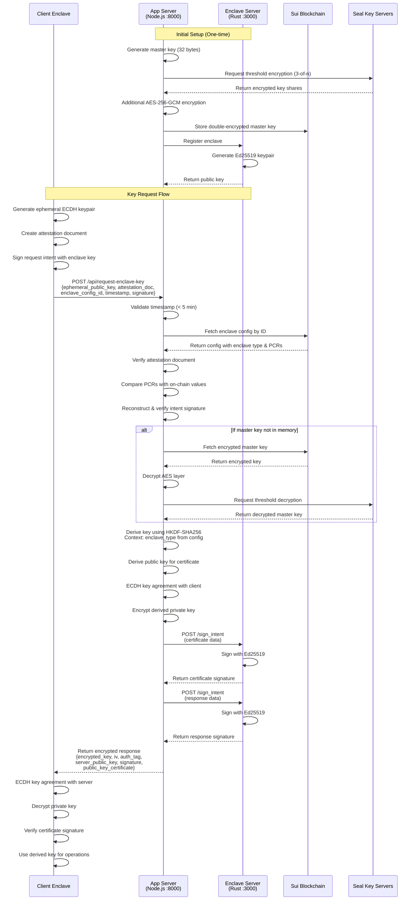

# Seal KMS: Distributed Key Management Service for Nautilus Enclaves

A secure key management system that generates and protects master private keys inside AWS Nitro Enclaves, leveraging Mysten's Seal protocol for distributed threshold encryption. The system provides secure key derivation services to other Nautilus enclaves, enabling them to obtain package-specific private keys through attestation-based authentication.

## Key Features

- **Hardware-Isolated Key Generation**: Master keys are generated inside AWS Nitro Enclaves
- **Distributed Key Protection**: Uses Mysten Seal's threshold cryptography (3-of-n) 
- **Zero-Trust Architecture**: Keys are encrypted before leaving the enclave
- **On-Chain Attestation**: Sui blockchain verifies enclave integrity
- **Double Encryption**: Additional AES-256-GCM layer for on-chain storage
- **Secure Key Derivation**: Derives unique keys based on enclave type (not just package ID)
- **Attestation-Based Authentication**: Client enclaves prove their identity via attestation documents

## Architecture Overview

### System Components

The Seal KMS consists of these main components:

1. **Enclave Server (Rust)**: Runs inside AWS Nitro Enclave (port 3000)
   - Generates and protects the enclave's Ed25519 key pair
   - Signs intents and attestation documents
   - Provides low-level cryptographic operations

2. **Application Server (Node.js)**: Runs on top of the enclave (port 8000)
   - Implements KMS business logic
   - Manages master key via Seal protocol
   - Handles key derivation using HKDF
   - Validates remote attestations
   - Encrypts responses using ECDH

3. **Client Nautilus Enclaves**: Applications requesting derived keys
4. **Sui Blockchain**: On-chain storage for encrypted keys and attestation verification
5. **Seal Key Servers**: Distributed threshold encryption/decryption service

### Two-Tier Architecture

The system uses a two-tier architecture where both components run inside the AWS Nitro Enclave:

- **Tier 1 (Rust Enclave Server)**: The base enclave server that manages the Ed25519 signing key. It exposes a minimal API on localhost:3000 for internal use only. This server handles attestation generation and intent signing.

- **Tier 2 (Node.js App Server)**: Runs on top of the Rust enclave server inside the same enclave. It implements the KMS business logic including master key management, key derivation (HKDF), attestation validation, and ECDH encryption. It calls the Rust server's `/sign_intent` endpoint via localhost:3000 to sign responses and certificates. The public API on port 8000 is exposed via vsock proxy to the host.

Both servers run inside the hardware enclave with full memory isolation from the host. The master key used for derivation and the Ed25519 signing key never leave the enclave's protected memory. Derived private keys are ephemeral - generated on demand and not persisted.

### Key Derivation Flow



## API Reference

The Seal KMS exposes two layers of APIs:

### Application Server API (Port 8000)

**Client applications should use this API layer.**

The Node.js application server implements the KMS logic and exposes these endpoints:

#### `POST /api/request-enclave-key`
Main KMS endpoint for client enclaves to request derived private keys.

**Request Body:**
```json
{
  "ephemeral_public_key": "hex...",      // Hex-encoded ECDH public key (prime256v1) for response encryption
  "attestation_document": "hex...",      // Hex-encoded attestation document from client enclave
  "enclave_config_object_id": "0x...",   // Sui object ID of client's enclave config (contains type info)
  "timestamp_ms": 1234567890,            // Request timestamp (must be within 5 minutes)
  "signature": "hex..."                  // Ed25519 signature of the intent
}
```

**Response (Success):**
```json
{
  "success": true,
  "data": {
    "encrypted_private_key": "hex...",   // Private key encrypted with ECDH shared secret
    "iv": "hex...",                      // Initialization vector for AES-256-GCM
    "auth_tag": "hex...",                // Authentication tag for AES-256-GCM
    "server_public_key": "hex...",       // Server's ephemeral ECDH public key
    "derived_for": "0x123::module::EnclaveConfig<0x456::app::MyApp>",  // Enclave type
    "timestamp_ms": 1234567890,          // Response timestamp
    "signature": "hex...",               // Ed25519 signature of the response
    "enclave_object_id": "0x...",        // KMS enclave object ID for validation
    "public_key_certificate": {          // Signed certificate for the derived public key
      "derived_public_key": "hex...",
      "kms_enclave_object_id": "0x...",
      "kms_enclave_public_key": "hex...",
      "target_enclave_config_id": "0x...",
      "enclave_type": "0x123::module::EnclaveConfig<...>",
      "issued_at_ms": 1234567890,
      "signature": "hex..."
    }
  }
}
```

**Response (Error):**
```json
{
  "success": false,
  "error": "Attestation validation failed: PCR values do not match"
}
```

**Validation Process:**
1. Timestamp validation (within 5 minutes)
2. Remote attestation validation against on-chain enclave config
3. PCR values verification against registered values
4. Extract enclave type from config object
5. Intent signature verification using public key from attestation
6. Authorization check (currently allows all valid enclaves)
7. Key derivation using HKDF-SHA256 with enclave type as context
8. Response encryption using ECDH key agreement (prime256v1)
9. Response signing via enclave's `/sign_intent` endpoint
10. Public key certificate creation and signing

#### `GET /health_check`
Proxied to the enclave server. Returns the enclave's public key.

**Response:**
```json
{
  "pk": "hex..."  // Hex-encoded Ed25519 public key
}
```

#### `GET /get_attestation`
Proxied to the enclave server. Returns an attestation document committed to the enclave's public key.

**Response:**
```json
{
  "attestation": "hex..."  // Hex-encoded attestation document
}
```

#### Debug Endpoints

These endpoints are for testing and development:

- `GET /debug/master-key` - Returns the master public key
- `POST /debug/master-key/encrypt` - Encrypts data with the master key
- `POST /debug/master-key/decrypt` - Decrypts data with the master key

### Enclave Server API (Port 3000)

**This API is used internally by the Application Server. Client applications typically don't need to call these endpoints directly.**

The Rust enclave server runs inside the AWS Nitro Enclave and provides low-level signing:

#### `POST /sign_intent`
Signs arbitrary data with the enclave's Ed25519 private key.

**Request Body:**
```json
{
  "payload": "hex..."  // Hex-encoded data to sign
}
```

**Response:**
```json
{
  "signature": "hex..."  // Hex-encoded Ed25519 signature
}
```

#### `GET /public_key`
Returns the enclave's Ed25519 public key.

**Response:**
```json
{
  "public_key": "hex..."  // Hex-encoded public key
}
```

#### `GET /load_config`
Loads configuration from the host via vsock.

**Response:**
```json
{
  // Configuration object from host
}
```

#### `GET /get_attestation`
Generates an attestation document containing the enclave's public key.

**Response:**
```json
{
  "attestation": "hex..."  // Hex-encoded attestation document
}
```

#### `GET /health_check`
Health check endpoint.

**Response:**
```json
{
  "pk": "hex..."  // Hex-encoded public key
}
```

## Contributing

Contributions are welcome! Please read our contributing guidelines and submit pull requests to the main repository.

## License

Apache 2.0 - See LICENSE file for details

## Acknowledgments

Built on [Mysten Nautilus](https://docs.sui.io/concepts/cryptography/nautilus) framework for verifiable off-chain computation on Sui.

## Contact

For questions about integration or security concerns, please open an issue or contact the maintainers.
