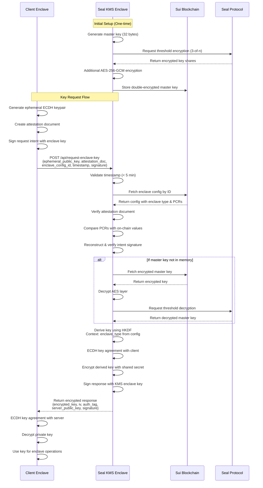

# Seal KMS: Distributed Key Management Service for Nautilus Enclaves

A secure key management system that generates and protects master private keys inside AWS Nitro Enclaves, leveraging Mysten's Seal protocol for distributed threshold encryption. The system provides secure key derivation services to other Nautilus enclaves, enabling them to obtain package-specific private keys through attestation-based authentication.

## Key Features

- **Hardware-Isolated Key Generation**: Master keys are generated inside AWS Nitro Enclaves
- **Distributed Key Protection**: Uses Mysten Seal's threshold cryptography (3-of-n) 
- **Zero-Trust Architecture**: Keys are encrypted before leaving the enclave
- **On-Chain Attestation**: Sui blockchain verifies enclave integrity
- **Double Encryption**: Additional AES-256-GCM layer for on-chain storage
- **Secure Key Derivation**: Derives unique keys based on enclave type (not just package ID)
- **Attestation-Based Authentication**: Client enclaves prove their identity via attestation documents

## Architecture Overview

### System Components

The Seal KMS consists of three main components:

1. **Seal KMS Enclave**: The master enclave that generates and manages the root key
2. **Client Nautilus Enclaves**: Applications requesting derived keys for their operations
3. **Sui Blockchain**: On-chain storage for encrypted keys and attestation verification

### Key Derivation Flow



## API Reference

### Client Enclave API

#### `POST /api/request-enclave-key`
Request a package-specific private key for a client enclave.

**Request Body:**
```json
{
  "ephemeral_public_key": "0x...",      // Hex-encoded ECDH public key for response encryption
  "attestation_document": "0x...",      // Hex-encoded attestation document from client enclave
  "enclave_config_object_id": "0x...",  // Sui object ID of client's enclave config (contains type info)
  "timestamp_ms": 1234567890,           // Request timestamp (must be within 5 minutes)
  "signature": "0x..."                  // Ed25519 signature of the intent (reconstructed server-side)
}
```

**Response (Success):**
```json
{
  "success": true,
  "data": {
    "encrypted_private_key": "0x...",   // Private key encrypted with shared secret
    "iv": "0x...",                      // Initialization vector for AES-GCM
    "auth_tag": "0x...",                // Authentication tag for AES-GCM
    "server_public_key": "0x...",       // Server's ephemeral ECDH public key
    "derived_for": "0x123::module::EnclaveConfig<0x456::app::MyApp>",  // Enclave type the key was derived for
    "timestamp_ms": 1234567890,         // Response timestamp
    "signature": "0x...",               // Signature of the response from Seal KMS
    "enclave_object_id": "0x..."        // Seal KMS enclave object ID for validation
  }
}
```

**Response (Error):**
```json
{
  "success": false,
  "error": "Attestation validation failed: PCR values do not match"
}
```

**Validation Process:**
1. Timestamp validation (within 5 minutes)
2. Attestation document verification against on-chain config
3. PCR values comparison with registered values
4. Intent signature verification (reconstructed from request fields)
5. Extract enclave type from config object (e.g., `0x123::module::EnclaveConfig<0x456::app::MyApp>`)
6. Authorization check (optional allowlist)
7. Key derivation using HKDF with enclave type as context
8. Response encryption using ECDH with client's ephemeral public key
9. Response signing with Seal KMS enclave's private key

## Contributing

Contributions are welcome! Please read our contributing guidelines and submit pull requests to the main repository.

## License

Apache 2.0 - See LICENSE file for details

## Acknowledgments

Built on [Mysten Nautilus](https://docs.sui.io/concepts/cryptography/nautilus) framework for verifiable off-chain computation on Sui.

## Contact

For questions about integration or security concerns, please open an issue or contact the maintainers.
